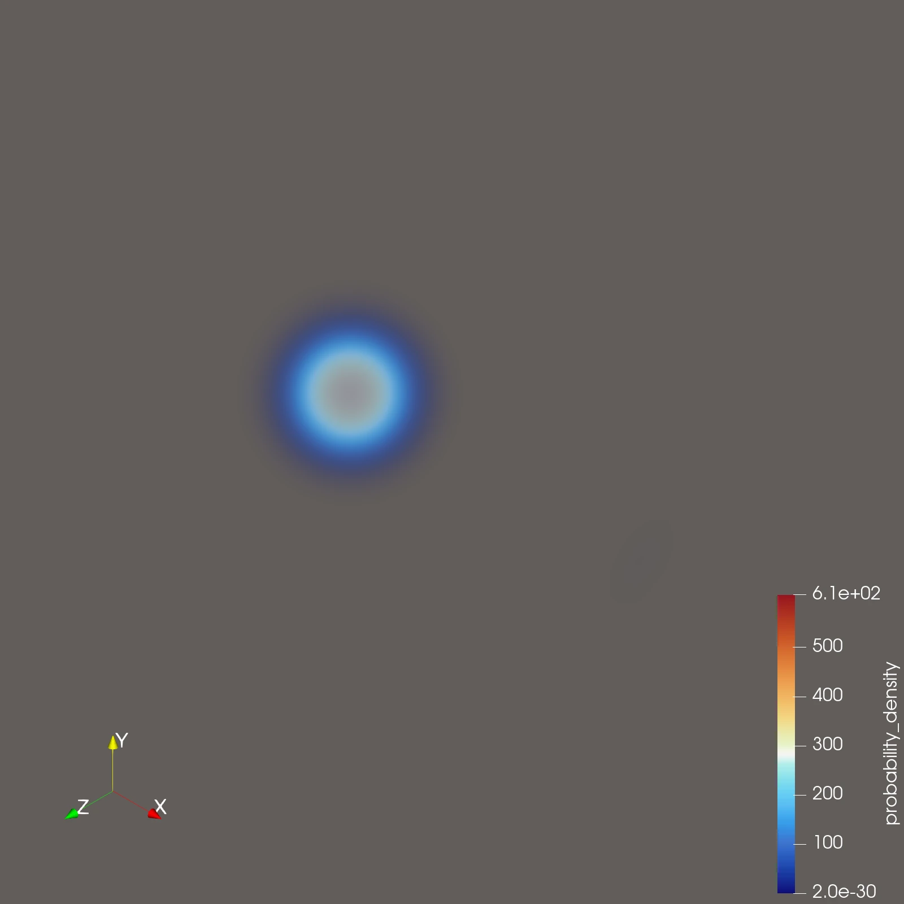

# Schrodinger

3D time-dependent Schrödinger simulation on a unit cube with a Gaussian wave packet and a central inverse-square attractive potential.




### Program Details

- Evolves a complex wave function `psi(x, y, z, t)` with an `H1` finite-element discretization built on MFEM.
- Uses a tetrahedral cube mesh from MFEM and refines it more aggressively near the singular central potential.
- Uses an initial Gaussian packet near `(0.2, 0.5, 0.5)` traveling in the positive `x` direction.
- Uses a central potential `V(r) = -k / r^2` centered at `(0.5, 0.5, 0.5)`.
- Constants are set so `V(r = 0.25) = -5e2`, with a clamp near the center at about `-1.66667e5`.
- Integrates in time with SUNDIALS ARKODE (implicit midpoint + fixed-point nonlinear solver).
- Writes ParaView output under `schrodinger3d/` using MFEM's `ParaViewDataCollection`.


## Build

### Requirements

- Zig 0.16.0

### Instructions

```bash
zig build -Doptimize=ReleaseSafe
```

Binary output:

- `zig-out/bin/schrodinger`


## Run

```bash
zig build -Doptimize=ReleaseSafe run
```

Run output includes:

- console diagnostics (norm, packet center, widths, peak amplitude)
- `schrodinger3d/`

Open `schrodinger3d/schrodinger3d.pvd` in ParaView to view the time sequence.
