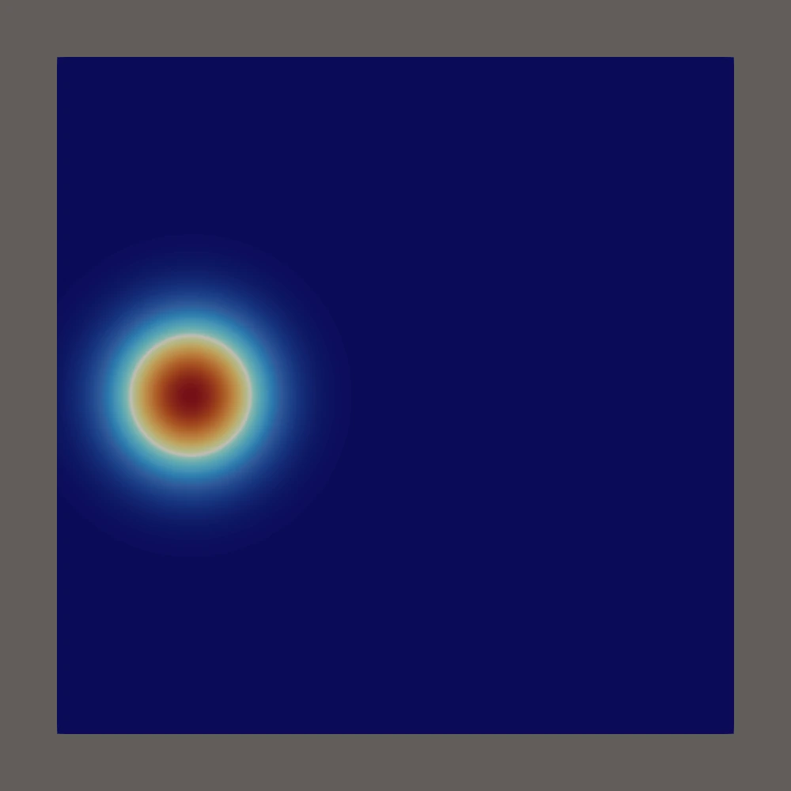

# Schrodinger

2D time-dependent Schrödinger simulation on a unit square with a Gaussian wave packet traveling toward a double-slit barrier.




### Program Details

- Evolves a complex wave function `psi(x, y, t)` on a `100 x 100` grid.
- Uses an initial Gaussian packet near the left-middle of the domain moving to the right.
- Applies a high-potential double-slit wall.
- Integrates in time with SUNDIALS ARKODE (implicit method).
- Writes one VTU file per timestep plus a VTU series file for ParaView.


## Build

### Requirements

- Zig 0.15.1

### Instructions

```bash
zig build -Doptimize=ReleaseSafe
```

Binary output:

- `zig-out/bin/schrodinger`


## Run

```bash
zig build -Doptimize=ReleaseSafe run
```

Run output includes:

- console diagnostics (norm, packet center, widths, peak amplitude)
- `schrodinger2d_t*.vtu`
- `schrodinger2d.vtu.series`

Open `schrodinger2d.vtu.series` in ParaView to view the time sequence.


## Run Tests

```bash
zig build -Doptimize=ReleaseSafe test
```

Tests currently focus on the custom complex `N_Vector` implementation in `test/test_nvector_complex.zig`.
